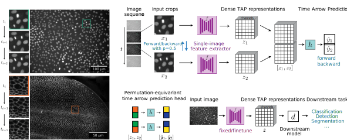

# Time arrow prediction (TAP) for live-cell microscopy

This repository contains the code for the TAP method published in
> Benjamin Gallusser, Max Stieber, and Martin Weigert<br>[*Self-supervised Dense Representation Learning for Live-Cell Microscopy with Time Arrow Prediction*](
https://link.springer.com/chapter/10.1007/978-3-031-43993-3_52)<br>MICCAI, 2023

TAP is a self-supervised pre-training method based on time arrow prediction that learns dense image representations from raw, unlabeled live-cell microscopy videos. The pre-training task consists of predicting the correct order of time-flipped image regions via a *single-image feature extractor* and a subsequent *time arrow prediction head* (as shown in the figure above).





The resulting dense representations capture inherently time-asymmetric biological processes such as cell divisions on a pixel-level, as indicated by the model's attribution maps (Grad-CAMs) show in the video below.

https://github.com/weigertlab/tarrow/assets/8866751/e5c5a26e-b9c1-4b80-862c-289029866ba4

Importantly, the representations from TAP pre-training are beneficial for training machine learning models that solve downstream image analysis tasks, such as detection and segmentation of dividing cells or cell state classification, particularly when only limited ground truth annotations are available as is commonly the case in practice.


## Installation

We provide TAP training and inference methods as the python package `tarrow`, which can be installed as follows:

- Install [`mamba`](https://mamba.readthedocs.io/en/latest/installation.html) (or `conda`, the same but slower) and create a fresh environment: `mamba create --name tarrow`.
- Activate the environment: `mamba activate tarrow`.
- Pip install the `tarrow` python package directly from this GitHub repository:
```
pip install git+https://github.com/weigertlab/tarrow.git
```


## Usage


### Example Data

TAP pretraining only needs a set of raw live-cell microscopy video (2D+time) as input, which can be given either as folders containing consecutive frames or as single 2D+t (`TYX`) tif files.

To try it out on some example data we provide the script `scripts/download_data.py`

```
python download_data.py
```

that downloads the public datasets HELA and MDCK (as listed in the [publication](
https://doi.org/10.48550/arXiv.2305.05511)) into a local folder `data`.


### Training a TAP model (no ground truth needed)

> Note: The default configurations assume that your machine has a Nvidia GPU with at least 24GB of memory (adjust the `batchsize` parameter in the corresponding `config.yaml` otherwise).

The main script for self-supervised training is called `scripts/train.py` and can be invoked via

```
python train.py -c config.yaml
```

where `config.yaml` defines the training arguments such as the location of the input videos (see [example config](scripts/configs/hela.yaml)).

The training arguments can also be passed in via command line in which case they will overwrite the values from `config.yaml` file, e.g.

* `--input_train` either folders containing a temporally ordered sequence of 2D images, or a individual 2D+time tif images.
* `--delta` timestep(s) between frames
* `--split_train` interval of video (relative) to use for training, e.g. `--split_train 0.0 0.8`
* `--split_val` interval of video (relative) to use for validation, e.g. `--split_val 0.8 1.0`.

```
python train.py --input_train my_video.tif --delta 1 2 --split_train 0.0 0.8 --split_val 0.8 1.0
```
### Monitor the training
To monitor the progress of TAP pretraining, run (from the same directory as the training script)

```
tensorboard --logdir runs
```

You can check out:
- The training and validation loss, as well as time arrow prediction accuracy
- Example input image patches, both from training and validation set
- The evolution of TAP attribution maps during training on a few example frames of the video, including insets of the most highlighted regions, as shown below.


### Using a trained TAP model

Load a trained TAP model to obtain dense representations:
```python
import tarrow

model = tarrow.models.TimeArrowNet.from_folder(model_folder="hela_backbone_unet")

# Dummy data: Batch, Time, Channel, X, Y
x = torch.rand(1, 2, 1, 96, 96)

# Dense dummy representations
rep = model.embedding(x)
print(f"Dense representations for image `x` with shape {tuple(rep.shape)}")
```
